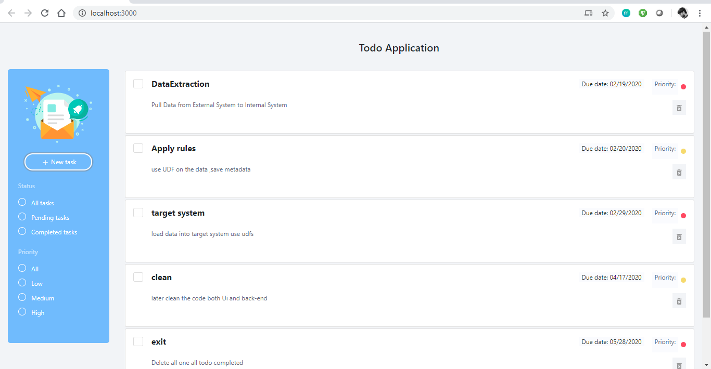

# *Todo Application*

    Todo Application : Simple Todo Appication with React and Node js  

## System Configuration

Please be sure you are using `nodeJS above 8.9.3 LTS`. 


## Get Started

Install the repository locally:

```bash
git clone git@github.com:akashsairaja/todo-application.git
```

## Client Settings 

```bash
cd client
cmd npm install 
```

## Server Setting 

``` bash
cd server
cmd npm install

cd /helpers
vi index.js
modify: mongoUrl=`mongodb://localhost:27017/graphdb`  
```

### Run Client

```bash
cd clinet 
npm start
```

### Run Server 

```bash
cd server 
npm start
```

Open `http://localhost:3000/` in browser.





## Front-End Documentation
   - [React](https://facebook.github.io/react/)
   - [Hooks](https://reactjs.org/docs/hooks-intro.html)
   - [Redux](https://redux.js.org/introduction/getting-started)
   - [Bootstrap](https://getbootstrap.com/docs/4.0/getting-started/introduction/)
   - [Reactstrap](https://reactstrap.github.io/components/alerts/)
   - [SASS](https://sass-lang.com/guide)


## Back-End Documentation
   - [NodeJS](https://nodejs.org/en/docs/)
   - [Express](https://expressjs.com/en/guide/routing.html)
   - [Mongoose](https://mongoosejs.com/docs/guide.html)
   - [MongoDB](https://docs.mongodb.com/)

```bash
npm run doc
```
